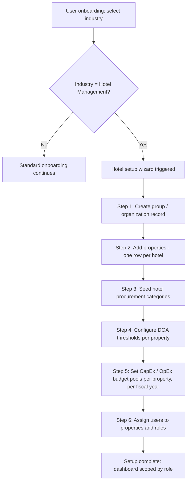
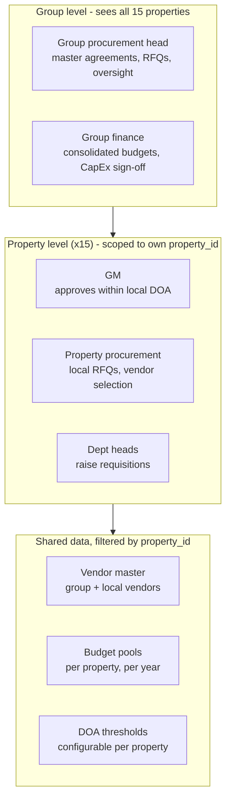
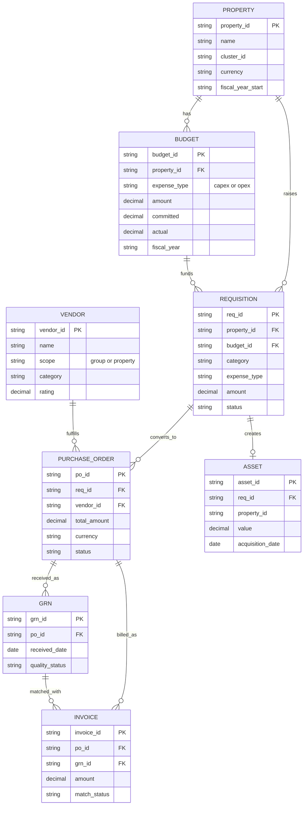
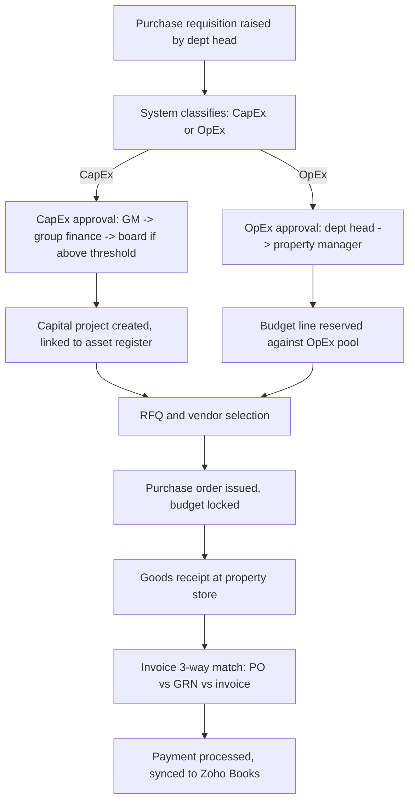

# Hotel Management Industry Module — Procurement System Spec

## Purpose

This document specifies the additional setup that should trigger when a user selects **"Hotel Management"** as their industry during the onboarding process of the existing Procurement Management System (Zoho Catalyst).

Reference client: **Galle Face Hotel** — a group operating **15 properties**, requiring group-level (Colombo HQ) and property-level procurement control, with CapEx and OpEx tracked separately per property.

Use this file as the implementation brief. Sections marked **Implementation Tasks** are directly actionable.

## Assumptions

- "Property Management" here means **multi-property administration** inside the procurement system (property master data, per-property budgets, per-property approval chains, group-level rollup reporting) — **not** a hotel PMS (room inventory, reservations, guest folios). If a PMS integration is actually needed, that is a separate module and should be scoped separately.
- Base currency is LKR. Multi-currency support is only required at the PO line level for imported CapEx items (engineering equipment, specialty F&B goods).
- The 15 properties are not yet named/configured in this spec — Section 7 gives the onboarding template to fill in with the client's real property list.

---

## 1. Onboarding Trigger & Setup Flow

When a user selects **Industry = Hotel Management** during onboarding, the system should branch into an industry-specific setup wizard before landing on the normal dashboard.



### Implementation Tasks

- [ ] Add an `industry_type` field to the organization/tenant record, enum includes `hotel_management`.
- [ ] On `industry_type == 'hotel_management'` at onboarding completion, redirect to a **Hotel Setup Wizard** (steps D–I above) instead of the generic empty dashboard.
- [ ] Wizard must be resumable — persist partial progress if the user exits mid-setup (property list started but budgets not yet entered, etc).
- [ ] Wizard should allow **bulk import** of properties via CSV (name, location, currency, cluster) since onboarding 15 properties one-by-one is painful.
- [ ] After wizard completion, seed the hotel-specific procurement categories (Section 6) and default DOA template (Section 5) automatically — user can edit after.

---

## 2. Multi-Property (Property Management) Model

Every property is a first-class record. Group-level roles see across all properties; property-level roles are scoped to one property only, enforced at the API layer (not just UI).



### Implementation Tasks

- [ ] Create/confirm a `PROPERTY` table: `property_id (PK)`, `name`, `cluster_id (nullable)`, `region`, `currency`, `fiscal_year_start`, `active`.
- [ ] Add `cluster_id` now (even if unused initially) — if Galle Face Group's 15 properties split into logical clusters (e.g. city vs resort, or geographic regions), this avoids a schema migration later. A regional manager role scoped to a cluster is a common ask at this scale.
- [ ] Every transactional table (`REQUISITION`, `PURCHASE_ORDER`, `GRN`, `INVOICE`, `ASSET`, `BUDGET`) must carry a non-nullable `property_id` foreign key.
- [ ] Every API function must inject the caller's allowed `property_id` set (derived from their role/assignment) into the query filter — never trust a `property_id` passed from the client alone.
- [ ] User-to-property mapping should support **many-to-many** (a regional manager may cover 3–4 properties; group roles cover all 15).
- [ ] Vendor master: add a `scope` field (`group` or `property`) so group-negotiated vendors (linens, F&B distributors, engineering spares) are visible to all 15 properties, while a property's local vendor (e.g. a regional produce supplier) is scoped to that property only but still visible to group procurement for reporting.

---

## 3. Data Model (ERD)



### Implementation Tasks

- [ ] Implement the schema above in Catalyst Data Store (or MySQL-compatible option if heavy relational reporting is needed).
- [ ] `BUDGET.expense_type` and `REQUISITION.expense_type` must be an enum: `capex` | `opex` — this single field drives approval routing, asset creation, and reporting rollup.
- [ ] `BUDGET` should track three numbers per line, not one: `amount` (allocated), `committed` (POs issued but not yet invoiced), `actual` (invoiced). Requisition approval should check `amount - committed - actual >= requested` before allowing approval to proceed.

---

## 4. CapEx vs OpEx Procurement Workflow



### Implementation Tasks

- [ ] Implement the branch (CapEx vs OpEx) as a Catalyst **Circuit**, not hardcoded if/else in a single Function — hotel groups frequently tweak DOA thresholds, and a Circuit keeps the approval chain configurable without redeploying code.
- [ ] On CapEx approval completion, auto-create a draft `ASSET` record (property_id, value, acquisition_date) for finance to complete — this is what feeds the depreciation schedule.
- [ ] On OpEx approval, immediately increment `BUDGET.committed` for that property/category — this is what blocks over-budget requisitions in real time, not just at month-end.
- [ ] 3-way match (Section 3) should flag (not silently block) mismatches beyond a configurable tolerance (e.g. 2%) for manual review rather than auto-rejecting — hotel invoicing commonly has small delivery variances (breakage, short-supply).

---

## 5. Roles & Delegation of Authority (DOA)

Default DOA template to seed during onboarding — editable per property afterward.

| Role | Scope | OpEx approval limit | CapEx approval limit |
|---|---|---|---|
| Dept head (F&B, Housekeeping, Engineering, etc.) | Own property | Up to configurable low threshold | Cannot approve CapEx |
| Property procurement manager | Own property | Up to configurable mid threshold | Cannot approve CapEx |
| GM | Own property | Unlimited (property level) | Up to configurable property CapEx threshold |
| Regional / cluster manager (optional) | Assigned cluster | Escalation approver | Escalation approver |
| Group procurement head | All 15 properties | Master agreements only | Reviews, does not approve spend |
| Group finance | All 15 properties | Budget administration | Required co-approval above GM's CapEx threshold |
| Board / owner | All 15 properties | — | Final approval above group finance threshold |

### Implementation Tasks

- [ ] Store DOA as a configurable table: `property_id, category (nullable = all), expense_type, amount_band_min, amount_band_max, required_approver_role, sequence_order`.
- [ ] Wizard should let the user set thresholds once at group level and apply as default to all 15 properties, with per-property override afterward (some properties may have delegated higher authority than others).

---

## 6. Hotel-Specific Procurement Categories (seed data)

Seed these as default requisition categories when `industry_type == 'hotel_management'`:

- Food & Beverage (perishables, beverages, kitchen supplies)
- Housekeeping (linen, amenities, cleaning supplies)
- Engineering & Maintenance (spares, tools, capital equipment)
- Front Office & Guest Services
- Spa & Wellness
- IT & Systems
- Laundry
- Security
- Landscaping & Grounds
- Marketing & Events
- Capital Projects (renovations, new builds, major equipment — CapEx only)

### Implementation Tasks

- [ ] Each category should have a default `expense_type` hint (e.g. F&B perishables default to OpEx, Capital Projects default to CapEx) but remain overridable per requisition.
- [ ] Categories should be group-wide (shared across all 15 properties) for consistent reporting, not per-property custom lists.

---

## 7. Property Onboarding Template (fill in with Galle Face Hotel's actual 15 properties)

| # | Property name | Location | Cluster | Currency | Fiscal year start | GM assigned |
|---|---|---|---|---|---|---|
| 1 | (flagship — replace with actual name) | Colombo | | LKR | | |
| 2 | | | | | | |
| 3 | | | | | | |
| ... | | | | | | |
| 15 | | | | | | |

### Implementation Tasks

- [ ] Wizard Step 2 should accept this as a CSV upload (columns: name, location, cluster, currency, fiscal_year_start) to avoid 15 rounds of manual entry.
- [ ] Validate uniqueness of property name within the organization before creating `PROPERTY` records.

---

## 8. Configuration Schema (reference JSON for the industry module)

```json
{
  "industry_type": "hotel_management",
  "organization": {
    "name": "Galle Face Hotel Group",
    "base_currency": "LKR",
    "property_count": 15
  },
  "properties": [
    {
      "property_id": "prop_001",
      "name": "",
      "cluster_id": "",
      "currency": "LKR",
      "fiscal_year_start": "01-01"
    }
  ],
  "doa_defaults": {
    "opex": {
      "dept_head_limit": 0,
      "property_procurement_limit": 0,
      "gm_limit": 0
    },
    "capex": {
      "gm_limit": 0,
      "group_finance_limit": 0,
      "board_required_above": 0
    }
  },
  "categories": [
    "food_and_beverage",
    "housekeeping",
    "engineering_maintenance",
    "front_office",
    "spa_wellness",
    "it_systems",
    "laundry",
    "security",
    "landscaping",
    "marketing_events",
    "capital_projects"
  ]
}
```

### Implementation Tasks

- [ ] Wizard output should populate this config object and persist it as the tenant's industry configuration — used to drive default categories, DOA seeding, and dashboard widgets specific to hotel operations.
- [ ] Numeric thresholds (`_limit`, `required_above`) should be left at 0/unset until the client confirms actual amounts — do not seed with placeholder currency values that could be mistaken for real limits.

---

## 9. Zoho Catalyst Implementation Notes

- Use **Circuits** for the CapEx/OpEx approval chains (Section 4) — configurable, human-in-the-loop, avoids hardcoded approval logic.
- Use **Job Scheduler** for nightly budget reconciliation (`committed` + `actual` vs `amount`) and for contract-renewal / par-level reorder alerts.
- Use **Data Store** for the core schema (Section 3); consider the MySQL-compatible option if group-level cross-property reporting needs complex joins.
- Sync invoice and payment data to **Zoho Books** (already connected) rather than duplicating GL logic in Catalyst — Catalyst owns the procurement workflow, Books owns accounting truth.
- Use **File Store** for quotes, invoices, contracts, and vendor compliance documents (business registration, VAT, insurance).
- Use **Catalyst Authentication** with property assignment stored in user metadata, enforced server-side on every Function call.

---

## 10. Implementation Checklist Summary

- [ ] Add `industry_type` enum + Hotel Setup Wizard trigger on onboarding.
- [ ] Build `PROPERTY` entity with `cluster_id`, bulk CSV import.
- [ ] Add `property_id` to every transactional table; enforce server-side row scoping.
- [ ] Implement CapEx/OpEx classification as a driving field, not just a report filter.
- [ ] Build DOA as a configurable table, seed defaults, allow per-property override.
- [ ] Seed hotel-specific procurement categories.
- [ ] Implement budget engine with `amount / committed / actual` tracking and real-time over-budget blocking.
- [ ] Implement CapEx approval → draft asset record creation.
- [ ] Implement 3-way match with configurable tolerance for manual review.
- [ ] Build property onboarding CSV template and config JSON persistence.
- [ ] Wire invoice/payment sync to Zoho Books.
